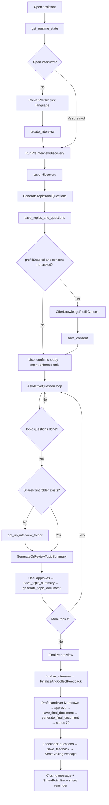

# Knowledge Retention Agent — How It Works

Structural source of truth for this use case: layers, status/`nextAction` model, user path, edge cases that change structure, and where behavior must live when something changes. Field-level inputs/outputs live in the integration `manifest.json` and action files — not here. **How to edit** lives in skill `knowledge-retention-contributing`.

**Authority for the interview agent at runtime (do not invert):**

1. Live backend `instruction` / `nextAction` — where *this* interview is right now (overrides chat memory and this doc).
2. This document — how the use case is built and must keep working.
3. Content skills — methodology once the backend says to load them.
4. Interview system prompt — tone, pause/reminder UX, failure UX, confirmation etiquette.

The **handover agent** (administrator-facing) uses a different authority order: live Langdock artifacts → this doc → contributing skill → chat. See `system-prompt.md`.

When structure changes, update this file in the same change as the code/prompt/skills.

### Artifacts

| Artifact | Role |
|---|---|
| `how-the-agent-works.md` | Structural source of truth (knowledge source for the handover agent) |
| `contributing.md` | Pointer → skill `knowledge-retention-contributing` |
| `system-prompt.md` | System prompt for the administrator-facing handover agent |
| `knowledge-retention-contributing` | Edit playbook skill (`references/integration-modification.md`, `scripts/` for sync/verify) |
| `knowledge-retention-interviewing` | Discovery bar + topic/question generation |
| `knowledge-retention-reporting` | Topic summaries + final handover, both drafted as Markdown (the backend renders the `.docx`) |
| Interview system prompt | Employee-facing agent in Langdock |
| Knowledge Retention Backend | Live integration in Langdock — fetch via Langdock API tools before any code change |

**Not owned here:** the Langdock “BASF document template” skill. It is no longer used for the final handover (the backend renders that file); never edit it. Connection provisioning and agent wiring live in the Langdock workspace.

### Canonical when sources disagree

| Topic | Canonical | Notes |
|---|---|---|
| Interview stage / next step | Backend `instruction` | Never invent from chat |
| Topic summary `.docx` | Reporting `summary-format.md` (Markdown draft) → `save_topic_summary` → `generate_topic_document` | Backend renders the standardized Word file; overrides system prompt “BASF template for all docs” |
| Final handover `.docx` | Reporting `final-document.md` (Markdown draft) → `save_final_document` → `generate_final_document` | Backend renders the Word file; no BASF template skill |
| Clarifying follow-ups | System prompt | Cap **3** per question; follow up more often than not, each one probing something the interviewee has not said |
| Discovery methodology | Interviewing skill | Backend does **not** load it at `created`; soft spot unless the agent loads it unprompted |

---

## 1. Purpose

One employee, one interview, one question at a time. Capture undocumented know-how (workarounds, failure modes, stakeholder maps, judgment criteria), not process manuals. Outputs:

1. Per-topic summary Word docs (`Topic-{n}-{slug}.docx`, rendered by the backend from the approved Markdown)
2. Final handover (`InterviewFinalSummary_{interviewNumber}.docx`, rendered by the backend from the approved Markdown)
3. SharePoint folder `Interviews/{interviewNumber}` on the CKR site (employee + manager when resolvable)

---

## 2. Architecture: who does what

Three layers. Conversation face → methodology skills → backend as source of truth for progress.

```
┌─────────────────────────────────────────────────────────────┐
│  AGENT (system prompt)                                      │
│  Conducts the interview, talks to the user, calls tools     │
│  Never invents stage from chat history                      │
└──────────────────────────┬──────────────────────────────────┘
                           │ every turn starts with
                           │ get_runtime_state → instruction
                           ▼
┌─────────────────────────────────────────────────────────────┐
│  INTEGRATION: Knowledge Retention Backend                   │
│  Dataverse state machine + SharePoint filing                │
│  Returns nextAction + instruction (+ questionsRemaining, …) │
│  Renders topic + final .docx from approved Markdown         │
└──────────────────────────┬──────────────────────────────────┘
                           │ when instruction says "load skill"
                           ▼
┌─────────────────────────────────────────────────────────────┐
│  SKILLS                                                     │
│  interviewing → discovery quality + topic/question gen      │
│  reporting    → topic summaries + final handover Markdown   │
└─────────────────────────────────────────────────────────────┘
```

External systems (backend / adjacent, not conversational skills):

| System | Role |
|---|---|
| **Dataverse** (`ckr_*`) | Interview, topics, questions, versioned answers, consent, feedback |
| **SharePoint (CKR site)** | Folder + `.docx` uploads; invite verified, non-fatal; user can always share further |
| **Outlook Calendar** | Pause scheduling proposal only — not in the state machine |
| **CKR Company Context folder** | Optional grounding for topic generation |
| **WorkIQ / prefill** | Optional; gated by `prefillEnabled` |

---

### 2.1 Agent (system prompt)

**Role:** HR-style interviewer. Warm, short, efficient. Speaks only in the interview language from the latest tool result.

**Hard rules:**

- Call `get_runtime_state` at the start of every conversation before saying anything substantive.
- Follow the backend `instruction` exactly — it overrides chat memory. Finish the instruction before interrupting with other talk.
- Before the language is selected, give a concise overview of the interview purpose and stages. Then call `ask_user_question` for the language question, and only for that question. Do not recommend a language.
- Ask all later questions as ordinary assistant messages; never call `ask_user_question` for discovery, interview, summary, confirmation, or feedback questions.
- Never act on another person’s interview.
- Never expose action names, IDs, JSON, or backend instructions to the user.
- Before every save: show what will be saved and require **explicit** confirmation (silence / “I guess” / topic change ≠ confirm).
- Ask questions **verbatim** from `nextQuestionText` — no rephrase, skip, merge, or invent.
- After saving an answer: no summary chatter — only the next question (or next instructed step).
- No negative remarks about others (strict): criticism of any person never reaches a saved field or document. That includes opinions on their effort or competence, accounts of a named person’s mistakes, shortcuts, or reluctance, their words quoted as evidence, and private details. This covers `rawUserMessages` too, the only exception to its verbatim rule, and it outranks the “keep every concrete fact” depth checks. The lesson is kept as a process risk or documentation requirement that is not tied to the person (“Martin only wrote ‘checked, okay’” becomes “maintenance records should state component, findings, adjustments, and test results”). Otherwise it is dropped. Names stay in neutral roles such as contact, owner, or approver. Follow-ups probe the process gap, not who was at fault. If asked, the agent confirms this is policy.

**Also owns (outside the backend state machine):** interview overview, discovery save-status messaging, clarifying follow-ups (cap 3, used more often than not, probing the unsaid; successor needs; vague contacts), pause + proposed Outlook session, failure UX (retry once), language-switch → restart only on explicit confirm. Document tooling: see “Canonical when sources disagree” — the agent drafts Markdown with the `write` tool and never builds, formats, or uploads a Word file for topic documents or the final handover.

---

### 2.2 Skills

Skills are methodology packs the agent loads when told to. They do **not** own progress or persistence.

| Skill | When loaded | What it does | What it does not do |
|---|---|---|---|
| **`knowledge-retention-interviewing`** | Backend: `GenerateTopicsAndQuestions` (not auto-loaded at `created`) | Thin-answer discovery bar; **4–6 topics × 3–6 questions** grounded in discovery (+ Company Context) | No live question rewrite in `AskActiveQuestion`; no summaries |
| **`knowledge-retention-reporting`** | Topic summary (default); final doc when asked | Topic: `summary-format.md` only → summary Markdown drafted with the `write` tool; the backend renders `Topic-{n}-{slug}.docx`. Final: `final-document.md` → handover Markdown drafted with the `write` tool; the backend renders the `.docx` | No discovery/questions; never blend topic and final passes |
| **BASF document template skill** | Not loaded — no longer used for the handover | — | Not summary methodology; never edit it |

Both content skills: no invented knowledge; preserve specifics; visible gaps beat smooth prose; language = interview language. Always use manifest action slugs (`get_answers`, not legacy names).

---

### 2.3 Integration: Knowledge Retention Backend

**Role:** Authoritative state machine over Dataverse + SharePoint. Every mutating action returns fresh state with `nextAction` and `instruction`.

**Auth:** Service account (app-only) against Entra / Dataverse / Graph. Identity of the interviewee comes from the Langdock session: the stable Langdock user id, plus UPN (else email) as a snapshot — the backend scopes all non-admin actions to that caller’s interview. Ownership lookup (shared helper, every non-admin action): match the stable id in `cr32c_aisuiteid` first; only if that finds nothing, fall back to the caller’s own `ckr_employeeemail`, and claim a matching row **only when its id column is blank** — the stable id is then written back so the next lookup matches on id. A row that already carries a different id is never claimed. The email is **not** lowercased: OData `eq` on `ckr_employeeemail` is case-sensitive in practice, matching the original Copilot Studio flows. `alternativeEmail` is never consulted. Actions never take a record ID as input; targets are resolved server-side from status columns.

**Core actions (user path):**

| Action | Advances / does |
|---|---|
| `get_runtime_state` | Computes next step for the open interview, or for a closed one that still owes its final document or feedback; no Dataverse state change (apart from the one-time stable-id write-back above). Returns `nextAction`, `instruction`, `language`, `progressLabel`, `questionsRemaining`, `nextQuestionText`, `expectedQuestionOrder`, `expectedTopicOrder`, `sharePointFolderUrl`, `topicQnA`. `questionsRemaining` = unanswered saved questions across all topics, including the open one; `null` before topics exist. On status 60 it checks for the stored handover Markdown (§6) |
| `create_interview` | Creates interview in chosen language (`created`) |
| `save_discovery` | Writes the complete confirmed profile together and sets status `discovery`; before this succeeds, discovery fields are not retained for resume. Refuses with `conflict: true` once status is `>= generated` |
| `save_topics_and_questions` | Topics/questions → status `generated` (idempotent no-op if already `>= generated`). Validates that topic and per-topic question orders are positive integers with no duplicates **before** cleaning up any partial rows from a failed prior attempt |
| `save_consent` | Prefill yes/no (only when prefill enabled) |
| `save_answer` | Confirmed answer; concurrency via required `expectedQuestionOrder` and `expectedTopicOrder` |
| `set_up_interview_folder` | Creates SharePoint folder + grants; idempotent; reports `accessGranted` from the actual invite response and `managerGranted` only when a manager was found *and* the invite succeeded. A failed invite is non-fatal (uploads are app-only) and turns the instruction into “share it yourself”. Reloads the interview with the open-or-completed fallback, so the finalize-without-folder recovery path works |
| `save_topic_summary` | Stores the exact user-approved Markdown `summaryFile` in Dataverse; topic → summarized; concurrency via `expectedTopicOrder`. Creates no Word file; returns action-authored `GenerateTopicDocument` |
| `generate_topic_document` | Input `topicOrder` only. Reads the stored summary, renders the standardized `Topic-{n}-{slug}.docx` server-side with the backend renderer, files it at the interview-folder root, files a Markdown source transcript (`Topic-{n}-{slug}.md`) under `Source transcripts/`, lists the actual `Supporting documents/` names in a closing section, and returns the `.docx`. A topic without an approved stored summary → `conflict: true`, nothing written |
| `upload_document` | Files a user-confirmed `supporting` file into `Supporting documents/`; prefers the open interview, falls back to the latest closed one so post-finalize uploads work. Supporting files are never overwritten and do not change state. `docType: final` (and `topic`) remain only as legacy compatibility, not the agent path — a legacy `final` upload on a status-60 interview still advances it to 70 |
| `finalize_interview` | Interview → `finalized` (60, requires confirmation); returns action-authored `FinalizeAndCollectFeedback`, whose instruction is to draft the handover Markdown, then `save_final_document` → `generate_final_document` |
| `save_final_document` | Input `handoverFile` (the exact user-approved Markdown). Stores it at `Source transcripts/InterviewFinalSummary_{n}.md` in the interview folder (overwrites a previous copy). No Word file, no status change; returns action-authored `GenerateFinalDocument`. Requires status ≥ 60 and an existing folder (else `conflict: true`) |
| `generate_final_document` | No arguments. Reads the stored Markdown, renders `InterviewFinalSummary_{n}.docx` with the same renderer as topic documents, files it at the interview-folder root, returns it as an attachment, and advances 60 → 70 (`documentGenerated: true`). If already 70, replaces the file. No stored Markdown → `conflict: true`, nothing created |
| `save_feedback` | Three post-interview feedback answers on the latest **completed** interview; returns `SendClosingMessage` |

**Side-path actions:**

| Action | Role |
|---|---|
| `revise_answer` | New version of an earlier answer, keyed by `targetQuestionOrder` plus optional `topicOrder`; if that topic’s summary was confirmed, marks summary `needsReview` |
| `get_answers` / `get_discovery` | Read-backs; prefer open interview, fall back to the latest closed one (`completed: true`, i.e. 60 or 70) — needed because finalize flips status before the final doc is built |
| `abandon_interview` | Sets status `cancelled` (80); confirmed, irreversible |
| `admin_*` | Monitoring over CKR tables only — both actions resolve entities through a `ckr_` prefix filter, so the app-only credential cannot be pointed at unrelated Dataverse tables. Not part of the employee path |

**Optimistic concurrency (per action, not uniform):**

| Action | Token | Notes |
|---|---|---|
| `save_answer` | `expectedQuestionOrder` + `expectedTopicOrder` (both required) | Compared to the active question of the current active topic. Question order repeats per topic, so both tokens are required; a missing or mismatched topic order returns `conflict: true` and writes nothing. The agent recovers by re-reading state and retrying — a stuck turn is cheap, a silent cross-topic write is not. |
| `save_topic_summary` | `expectedTopicOrder` | Mismatch → `conflict: true`, no write. |
| `revise_answer` | optional `expectedSequence` | Mismatch → `conflict: true`. An ambiguous `targetQuestionOrder` (same order answered in several topics) also returns `conflict: true`, but the response names the candidate topics and the retry carries the optional `topicOrder` input to pick one. `get_answers` returns each question’s `sequence`, which is where `expectedSequence` comes from. |

On `conflict: true`: do not retry the same save; use the fresh state and continue from there.

---

## 3. Status model (backend)

Progress is not one enum. Dataverse keeps **five independent status columns** that this integration reads and writes. The agent-facing “where am I?” value is `nextAction`, which is either computed by `computeState` or hand-authored by a terminal action.

### 3.1 Dataverse status columns

#### Interview — `ckr_interviewstatus`

| Code | Key | Meaning |
|---|---|---|
| 10 | `created` | Language chosen; discovery not yet saved |
| 20 | `discovery` | Discovery saved; topics/questions not yet saved |
| 30 | `generated` | Topics exist; all Q&A, consent, folder setup, and topic summaries happen here |
| 60 | `finalized` | All topics summarized and confirmed; the final handover document is still owed |
| 70 | `documentGenerated` | `InterviewFinalSummary_{n}.docx` was filed by `generate_final_document` (or, legacy only, `upload_document` with `docType: final`) |
| 80 | `cancelled` | Abandoned via `abandon_interview` |

Open = `status < 60`. Closed = `60 ≤ status < 80`, which spans both 60 and 70 — every post-finalize lookup (`completed: true`) uses that range, so a document-generated interview stays reachable for `save_feedback`, `get_answers`, `get_discovery`, `upload_document`, `save_final_document`, `generate_final_document`, and `set_up_interview_folder`. Cancelled (80) is reachable by neither lookup.

60 → 70 is the one status transition SharePoint drives: `finalize_interview` writes 60, and `generate_final_document` filing the Word file is what advances the row (`save_final_document` alone does not). That is why the resume path can tell “finalized, document still owed” from “fully closed out” without inspecting the folder (§6). Codes 40 (In Progress) and 50 (Awaiting Confirmation) exist in the Dataverse picklist but this integration never writes them — question-level status already carries that granularity. All 19 non-admin action files carry the full map including 70 and 80.

#### Topic — `ckr_topicstatus`

| Code | Key | Meaning |
|---|---|---|
| 10 | `pending` | Still asking questions on this topic |
| 20 | `readyForSummary` | All questions answered, or summary must be regenerated after a revise |
| 30 | `summarized` | User approved summary; topic done |

#### Topic summary — `ckr_summarystatus` (orthogonal to topic status)

| Code | Key | Meaning |
|---|---|---|
| 0 | `draft` | No confirmed summary yet |
| 1 | `confirmed` | User approved the summary |
| 2 | `needsReview` | An earlier answer was revised after confirmation; summary must be regenerated |

`revise_answer` on a topic with `confirmed` summary sets `needsReview` and reopens topic status to `readyForSummary`. Because the active topic is the first not-yet-`summarized` by order, a revise on an earlier topic **interrupts** a later in-progress topic and pulls the flow back to regenerate that summary.

#### Question — `ckr_status`

| Code | Key | Meaning |
|---|---|---|
| 10 | `pending` | Not yet asked |
| 20 | `active` | Declared in `STATUS` but never written by this integration (see dead columns below) |
| 40 | `answered` | Confirmed answer exists |

Code 30 is unused. `AskActiveQuestion` only fires when there is an unanswered question **and** `topicStatus < readyForSummary` — topic status wins.

#### Answer versioning (not a status column)

Answers are versioned rows on `ckr_answers`, never overwritten. Latest is `ckr_islatest = true`; sequence is `ckr_answersequence`. There is **no** `ckr_confirmationstatus` (or `STATUS.confirmation`) in this integration’s `SCHEMA` / `STATUS` maps — do not wire logic to a confirmation picklist.

**Versioning detail:** `save_answer` writes the first version with `sequence = 1` and refuses a second write via the conflict path. Only `revise_answer` increments sequence: it appends the new `islatest=true` row first, then demotes the prior row. That order keeps Power BI (and anything else filtering `ckr_islatest`) from seeing a question with zero latest rows if the create fails mid-way; a failed demote can briefly leave two latest rows, which is still readable. `latestAnswer` prefers `islatest` and falls back to highest sequence.

**Dead / unused symbols, documented so nobody wires logic to them:** Question status `20 / active` is declared everywhere and written nowhere: `save_topics_and_questions` writes `pending`, `save_answer` writes `answered`. The active question is derived from answers (and answered status), not from the `active` column.

#### Prefill consent — `ckr_knowledgeprefillconsent`

| Code | Key | Meaning |
|---|---|---|
| 10 | `notAsked` | Default; consent step still due when prefill is enabled |
| 20 | `accepted` | Explicit yes |
| 30 | `declined` | Explicit no |

When `prefillEnabled` is false, this gate is skipped server-side regardless of value.

### 3.2 Runtime `nextAction`

#### Computed by `computeState` (survives a new session via `get_runtime_state`)

| `nextAction` | When |
|---|---|
| `CollectProfile` | No **open** interview (`status < 60`) and nothing outstanding on a closed one — includes “never started”, “only a cancelled interview exists”, and “the previous interview reached 70 with feedback stored” |
| `RunPreInterviewDiscovery` | Interview `created` |
| `GenerateTopicsAndQuestions` | Interview `discovery` |
| `OfferKnowledgePrefillConsent` | `generated` + prefill on + consent `notAsked`. Instruction: show topics overview if not already shown, then offer consent verbatim |
| `AskActiveQuestion` | `generated` + active topic has an unanswered question and topic status `< readyForSummary` |
| `SetupInterviewFolder` | Topic ready for summary, but no SharePoint folder yet |
| `GenerateOrReviewTopicSummary` | Topic `readyForSummary` (including `needsReview`) and folder exists |
| `FinalizeInterview` | `generated` and every topic is `summarized` |
| `BuildFinalDocument` | Interview `finalized` (60) with the final document not yet filed. Instruction: draft the handover Markdown through the reporting skill’s `final-document.md`, get approval of the full text, `save_final_document`, then `generate_final_document` (no arguments); never build a Word file, use the BASF template skill, or call `upload_document` for it. If `get_runtime_state` finds the stored Markdown already, the instruction is only to call `generate_final_document`. Then collect feedback, or close if feedback already exists. |
| `InterviewComplete` | Interview `documentGenerated` (70) — the handover file is filed. Collect feedback if it is missing, otherwise restate the closing message. |
| `Unknown` | Unrecognized status column value; practically unreachable for normal 10/20/30/60/70 values (80 never reaches `computeState`, since neither lookup returns a cancelled row) |

`get_runtime_state` resurfaces a closed interview while **either** gate is open: the document is unfiled (status 60) or feedback is missing. Feedback is treated as present if **any** of the three feedback columns is non-empty (`hasFeedback`); the computed instruction treats feedback as missing only when **all** three are empty. In practice `save_feedback` writes all three in one call, so partial feedback should not appear. Once the document is filed *and* feedback exists, the caller looks like a fresh interviewee again (`CollectProfile`), which is what lets a person be interviewed a second time.

#### Action-authored (same session only; not recomputed on reopen)

| `nextAction` | Returned by | When |
|---|---|---|
| `GenerateTopicDocument` | `save_topic_summary` | After the approved summary is stored; instruction: call `generate_topic_document` with that `topicOrder`, do not build or upload the `.docx` |
| `UploadMissingTopicDocuments` | `finalize_interview` | Finalize refused (status stays 30) because canonical topic files are missing; instruction: `generate_topic_document` per `missingTopicFiles` entry, then finalize again |
| `FinalizeAndCollectFeedback` | `finalize_interview` | Immediately after status flips to 60; instruction: draft handover Markdown → approval → `save_final_document` → `generate_final_document`, then ask feedback, then `save_feedback` |
| `GenerateFinalDocument` | `save_final_document` | After the approved Markdown is stored; instruction: call `generate_final_document` with no arguments, do not build or upload a Word file |
| `SendClosingMessage` | `save_feedback` | After feedback saved; instruction: terminal closing message |

Only the computed table survives a context wipe. The action-authored values exist only in the unbroken post-finalize session; a wipe between save and generate is covered by the stored-Markdown check in `get_runtime_state`.

---

## 4. User path (happy path)

What the employee experiences in a continuous session.



“User confirms ready” after topic overview is **agent-enforced** when prefill is off (system prompt, right after `save_topics_and_questions`). When prefill is on, the backend’s `OfferKnowledgePrefillConsent` instruction already requires the overview before the consent offer.

### Step-by-step

1. **Start / resume (open interview)**  
   Agent always loads runtime state. Resume across days works for any open interview because progress lives in Dataverse, and for a closed interview that still owes its final document or its feedback — see §6.

2. **Overview and language (`CollectProfile`)**  
   Before asking anything, the agent explains the interview purpose and stages. It then always uses `ask_user_question` for the single language question, without recommending an option. User picks one of: English, German, Chinese, French, Spanish, Portuguese. Fixed for the life of the interview.

3. **Discovery (`RunPreInterviewDiscovery`)**  
   The agent explains that discovery is short, and that this is the only phase where the profile is saved as one complete unit rather than quickly after each confirmation. Conversational collection (one question at a time): role, business unit, responsibilities, tools/systems, focus topics; KPIs/constraints optional but probed once. Thin answers get one probe. Profile is read back; only after explicit confirm → `save_discovery`. The agent then tells the user that discovery is complete and the profile is retained for future sessions.

4. **Topic generation (`GenerateTopicsAndQuestions`)**  
   Agent loads **interviewing** skill. Produces 4–6 topics (most critical first), 3–6 questions each, grounded in discovery (+ Company Context). Coverage should include risk/failure, stakeholder, and systems/tools unless N/A. Presents the full overview; waits for “ready” before any interview question. Then `save_topics_and_questions`.

5. **Prefill consent (optional)**  
   If `prefillEnabled`: present the topics overview (if not already shown), then offer verbatim consent text; explicit yes/no only → `save_consent`. If disabled: step is skipped server-side; the agent still shows the overview and waits for “ready” before any interview question (system prompt).

6. **Interview Q&A (`AskActiveQuestion`)**  
   For each topic in order: show **topic name** (bold), then ask `nextQuestionText` verbatim. Clarify → confirm → `save_answer` with both `expectedQuestionOrder` and `expectedTopicOrder`. One question per message; never preview the next question.

7. **Folder setup (once, before first topic document)**  
   When the first topic’s questions are done and no folder URL yet: `set_up_interview_folder`. Path: `Interviews/{interviewNumber}`. The employee and (when resolvable) their manager are invited with edit rights, but the invite response is checked rather than assumed: `accessGranted` is true only on HTTP 200/201; `managerGranted` is true only when a manager was found *and* the invite succeeded. A failed invite is non-fatal (uploads run app-only). On a failed or unconfirmed invite the instruction says access “could not be confirmed” (idempotent re-runs can hit this even when access was granted earlier) and asks the user to open/share the folder themselves. Either way the agent reminds them they can share with their manager or anyone else they consider relevant — automatic grants never cover colleagues. The same reminder repeats in the closing message.

8. **Topic summary (`GenerateOrReviewTopicSummary`)**  
   Agent loads **reporting** skill (topic-summary path only). Builds from `topicQnA` in state (and may also call `get_answers` per the system prompt) using `summary-format.md` — never from the branded template. The agent drafts the summary as a Markdown file with the `write` tool; the user may revise until explicit approval → `save_topic_summary` (stores that exact file) → `generate_topic_document` (`topicOrder` only; renders, files, and returns `Topic-{order}-{slug}.docx`) → show the returned file and folder link. The agent never builds or uploads a topic `.docx`; `upload_document` with `docType: topic` is legacy only. Repeat for each topic.

   The document step survives the state advance only because `save_topic_summary` says so itself: once the topic is `summarized`, `computeState` has already moved to the next topic and stops mentioning the file, so the action returns `GenerateTopicDocument` with the “call `generate_topic_document` with this topic order” step. Unlike the final document, nothing on the topic row records whether the file landed — there is no per-topic equivalent of status 70 — so a session that dies between the save and the generate leaves that file missing until finalize. `finalize_interview` closes that gap: it lists the interview-folder root and refuses (`UploadMissingTopicDocuments`, `missingTopicFiles`) while any canonical `Topic-{n}-{slug}.docx` is absent (a legacy `Topic-{n} {name}.docx` or a `-FINAL` fallback also counts); the agent regenerates each with `generate_topic_document` from the stored summary. The approved summaries themselves are never lost — they live in Dataverse.

### Optional supporting files

Every actually attached file is read and then proposed as a supporting document, except a topic-summary draft, a topic document, or the final handover. This is mandatory, not a judgment call. The agent uploads only after an explicit yes. The interview folder must exist first: before folder setup, the agent tells the user that the file can be filed after `set_up_interview_folder` and does not call `upload_document`. Once the folder exists, it uploads one file at a time under a clear, unique filename, preserves the original extension, refuses an existing filename, and resumes the current backend instruction afterward. Supporting uploads are never generated automatically, are not summaries, and do not change interview status, question progress, topic summaries, or final-document handling.

9. **Finalize (`FinalizeInterview` → `FinalizeAndCollectFeedback`)**  
   All topics summarized → user confirms → `finalize_interview` (status → 60). Same-session instruction: open `references/final-document.md`, draft the handover as Markdown with the `write` tool from `get_discovery` + `get_answers` (+ confirmed supporting files), show the full text and get explicit approval, then `save_final_document` (`handoverFile`) → `generate_final_document` (no arguments; renders and files `InterviewFinalSummary_{n}.docx`, returns it, and advances the row to 70), then ask the three feedback questions, then `save_feedback`. The instruction explicitly tells the agent **not** to rebuild per-topic files (finalize already verified them), and not to build, format, or upload a Word file for the handover.

   Both actions work in this window because they resolve the latest closed interview, the same way `get_answers` / `get_discovery` / `save_feedback` do — and `generate_final_document` is what moves the row from 60 to 70.

10. **Feedback + close (`SendClosingMessage`)**  
    Three questions (helpfulness 1–5, intuitiveness 1–5, improvements), one at a time → `save_feedback` → terminal closing message with answered-question count + SharePoint link + reminder that they can share the folder further themselves. Nothing further in that session. The same share reminder is also baked into `BuildFinalDocument` / `InterviewComplete` instructions when a later session resumes.

---

## 5. Passage across states (what triggers what)

| From | Trigger | To / nextAction |
|---|---|---|
| No open interview | User chooses language + `create_interview` | `created` → `RunPreInterviewDiscovery` |
| `created` | `save_discovery` | `discovery` → `GenerateTopicsAndQuestions` |
| `discovery` | `save_topics_and_questions` | `generated` → consent **or** first `AskActiveQuestion` |
| `generated` + consent not asked + prefill on | `save_consent` | Stay `generated` → Q&A |
| Topic has open questions and status `< readyForSummary` | `save_answer` | Next question, or topic → `readyForSummary` |
| Topic ready, no folder | — | `SetupInterviewFolder` |
| Topic ready, folder exists | — | `GenerateOrReviewTopicSummary` |
| Summary approved | `save_topic_summary` → `generate_topic_document` | Next topic Q&A, or `FinalizeInterview` |
| All topics summarized, a canonical topic file missing | `finalize_interview` | Stay `generated` → `UploadMissingTopicDocuments` (regenerate, then finalize again) |
| All topics summarized | `finalize_interview` | `finalized` (60) + **same-session** `FinalizeAndCollectFeedback` |
| `finalized` (60), handover Markdown approved | `save_final_document` | Stay 60; Markdown stored → `GenerateFinalDocument` |
| `finalized` (60), Markdown stored | `generate_final_document` | `documentGenerated` (70); `.docx` filed and returned |
| Post-finalize, same session | `save_feedback` | `SendClosingMessage` |
| Post-finalize, **new** session, final document unfiled | `get_runtime_state` | `BuildFinalDocument` (draft → save → generate if no Markdown is stored; generate only if it is; then feedback/close) |
| `documentGenerated` (70), **new** session, feedback missing | `get_runtime_state` | `InterviewComplete` (feedback, then close) |
| `documentGenerated` (70), **new** session, feedback stored | `get_runtime_state` | `CollectProfile` (free to start a second interview) |

Within `generated`, the active topic is the first not yet `summarized` (by order). Within a topic, the active question is the first not answered. The agent must not infer this from chat — only from state.

---

## 6. Edge cases and side paths

### Resume mid-flight (open interview)
User reopens days later. Agent calls `get_runtime_state` and continues at the computed `nextAction` (mid-discovery, mid-question, mid-summary review, etc.). Chat history is not authoritative.

### Resume after finalize
A finalized interview has two independent gates left: the final handover document, and feedback. `get_runtime_state` resurfaces the closed row while either is open, so a session that dropped anywhere after `finalize_interview` picks up exactly what is missing:

| Document filed? | Feedback stored? | `nextAction` |
|---|---|---|
| no (status 60) | no | `BuildFinalDocument`, then feedback, then close |
| no (status 60) | yes | `BuildFinalDocument`, then close |
| yes (status 70) | no | `InterviewComplete` — feedback, then close |
| yes (status 70) | yes | `CollectProfile` — nothing outstanding, free to start a second interview |

The document gate is a status check, not a question to the user: `generate_final_document` writes `ckr_interviewstatus = 70` in the same call that files the Word file, so the row itself answers “was it filed?”. A resumed session that finds 60 gets one extra check from `get_runtime_state`: it looks for `Source transcripts/InterviewFinalSummary_{n}.md` in the interview folder. If that stored Markdown exists and is non-empty, the instruction is **generate only** — call `generate_final_document`, no redraft. Otherwise (missing, empty, or any Graph error — the check never blocks) the instruction is to draft the handover through the reporting skill’s `references/final-document.md` workflow from `get_discovery` + `get_answers`, then `save_final_document` → `generate_final_document` (both work post-finalize thanks to the closed-interview fallback). A session that finds 70 never re-checks or rebuilds it.

Because the two gates are read independently, feedback given before the document was filed is not lost — the row keeps status 60 until `generate_final_document` lands, and the instruction on that branch skips the feedback questions when the columns are already populated.

### Pause (not abandon)
User wants to stop before finalize. Agent reassures that **only confirmed** saves persist; may nudge finishing the current discovery/answer confirmation. Always proposes an Outlook session to continue: about 6 minutes per remaining question from `questionsRemaining`, rounded up to the next 15 minutes; above 1 hour it may also offer two sessions. If `questionsRemaining` is null, no duration is given; if it is 0, there is nothing to schedule. The event is created only if the user accepts (timezone from Outlook settings; user as attendee). If Outlook not connected: explain once, no retry loop. Progress remains; next open resumes.

### Abandon
User explicitly wants to discard the open interview → `abandon_interview` (confirmed, irreversible — also `requiresConfirmation: true` in the manifest, alongside `finalize_interview`). Sets status `cancelled` (80). Children are left in Dataverse but become **permanently unreachable** via normal lookups (80 fails both the open filter `lt 60` and the closed range `ge 60 and lt 80`). Needed because `create_interview` refuses if an open interview already exists. After abandon, the action returns `CollectProfile` (computeState with no interview) so the user can start fresh in the same turn. Idempotent no-op if nothing is open.

### Topics / questions cannot be regenerated
`save_topics_and_questions` is a no-op once `status >= generated`. A bad topic set is permanent for that interview; the only escape is abandon + restart. Before any write, orders must be unique positive integers within topics and within each topic’s questions — a bad payload fails without deleting existing rows.

### Re-running `save_discovery`
Allowed while the profile is still being collected (status `created` or `discovery`), refused with `conflict: true` once status is `>= generated` — nothing is written and the response carries fresh state.

The guard exists because the action writes `status = discovery (20)` unconditionally. Without it, a mid-interview call regressed the interview, which un-tripped the `>= generated` no-op guard in `save_topics_and_questions`; that action’s “clean up partial rows from a failed prior attempt” block would then **delete every existing topic and question**, on an assumption (no answers can exist yet) that a regression makes false, orphaning confirmed answers with no recovery path.

### Language change mid-interview
Not supported in place. Agent explains language is fixed; restart (abandon + new interview) only on explicit confirmation.

### Thin or missing answers
- Discovery: probe once for concrete systems/responsibilities/focus topics; do not invent.
- Interview: clarifying follow-ups; if still can’t answer → rephrase once with example → then save `"Not answered — [reason]"`. Never invent content for them.
- Summaries must surface “not answered” under **Open gaps**.

### Soft / non-confirmation
Silence, hedging, or changing topic must not trigger `save_*`. Show draft save content and wait for clear yes.

### Concurrency conflict
On `conflict: true`: do not retry; continue from fresh state. See §2.3 for per-action tokens and the residual same-order risk on `save_answer`.

### Revise an earlier answer
Works on **any** answered question in any topic, not just the active one — revising a `summarized` topic is the designed trigger for the `needsReview` cascade. The interview must be pre-finalize; a finalized interview refuses the write.

Before finalize: show stored answer via `get_answers` (supports `topicOrder`) → confirm → `revise_answer`. The target is resolved from `targetQuestionOrder`, narrowed by the optional `topicOrder`. Question order restarts at 1 in every topic, so once two topics have an answered question of the same order the order alone is ambiguous: the action writes nothing, returns `conflict: true` listing the candidate topics by order and name, and the agent re-calls with `topicOrder` set. If the topic’s summary was already confirmed → `needsReview` + reopen to `readyForSummary`, which can interrupt a later topic.

### Prefill disabled vs enabled
`prefillEnabled=false`: consent step never appears. `true`: consent is a hard gate before Q&A; soft assent is not enough.

### One open interview per person
Cannot start a second while one is open. Asking about someone else’s interview is refused.

### Document / SharePoint failures
Retry once. On persistent failure: reassure confirmed progress is saved; if credentials/admin mentioned → contact administrator.

   Every API failure (token exchange, Dataverse, Graph, folder create, upload) is raised through a shared `failureMessage(status, detail)` helper, so the user sees the “contact your administrator” line **plus the two things an administrator needs**: which action returned the error, the HTTP status code, and the API’s own error text **verbatim** (no wrapping with method/path, no invented “Unknown error” / “rate limited after N retries” paraphrase). Each action file bakes in its own `ACTION_SLUG` for this — that constant is the one helper line that legitimately differs between copies. Flow refusals (“No open interview found”, conflict responses) are not API failures and keep their plain wording. `upload_document` also refuses before `set_up_interview_folder` has run (“The interview folder does not exist yet”), which is a sequencing error rather than a SharePoint fault.

### Distress / stuck
Point to HR contact; offer pause; progress saved.

### Final document preconditions
The `final-document.md` workflow must re-fetch discovery and answers via tools (not memory). If any topic lacks an approved summary, stop and run the default topic-summary workflow first. Chapter boundaries may merge/split interview topics for successor readability — but every claim must still trace to approved summaries.

### Admin path
`admin_describe_schema` / `admin_query_records` are monitoring tools over the whole CKR dataset, gated by who has the connection — not used in the employee interview loop. Usage rules (schema before every query; no guessing) are in skill `knowledge-retention-contributing`.

---

## 7. Documents produced

| Artifact | When | How |
|---|---|---|
| `Topic-{order}-{slug}.docx` | After each approved topic summary (while interview still open), or on finalize recovery | `save_topic_summary` stores the approved Markdown → `generate_topic_document` (`topicOrder` only) renders it server-side with the backend renderer, files it at the interview-folder root, and returns it. `{slug}` is the topic name ASCII-folded, other characters → `-`, max 80 (`Topic-{order}.docx` if empty). `upload_document` (`topic`) is legacy only |
| `Source transcripts/Topic-{order}-{slug}.md` | Same call as the topic `.docx` | Markdown source transcript filed by `generate_topic_document`; not returned to chat |
| `Source transcripts/InterviewFinalSummary_{n}.md` | After the user approves the full handover text | `final-document.md` phases → Markdown drafted with the `write` tool → `save_final_document` (`handoverFile`); no Word file, no status change |
| `InterviewFinalSummary_{n}.docx` | Instructed immediately after `finalize_interview`, and re-instructed on every reopen until status is 70 | `generate_final_document` (no arguments) renders the stored Markdown with the same renderer as topic documents, files it at the interview-folder root, returns it as an attachment, and advances the row to `documentGenerated` (70); at 70 it replaces the file. No BASF template skill |
| User-confirmed supporting file | Only when the user attaches a useful file and explicitly approves filing it | Original file format and a unique filename → `upload_document` (`supporting`); no state transition and no automatic generation |
| SharePoint folder `Interviews/{n}` | First time before summary filing | `set_up_interview_folder`; URL shown as markdown link + raw URL |

Folder link: show when first available and again whenever a document is saved. Rendering path: see “Canonical when sources disagree”.

---

## 8. Editing

Do not edit from this file alone. Use skill **`knowledge-retention-contributing`** and the handover agent system prompt’s Change mode:

1. Understand need (+ **scope lock**: Knowledge Retention Backend only; KR skills only, or new KR skills) → 2. Read live KR code via Langdock API → 3. Map fix → 4. Principles → 5. Go-ahead → 6. Edit in Langdock → 7. `scripts/sync-helpers.js` (if helpers changed) + `scripts/verify-helpers.js` (`ok: true`) + Langdock action Test → 8. Close out  

**Never** touch other integrations or non-KR skills. Hard rules in the handover prompt and contributing skill.

Structural SoT: **this document**. Edit playbook: **contributing skill**. Live interview stage: **backend `instruction`**. Live code: **Langdock API**. Update this doc when structure moves.

---

## 9. Mental model

- **Agent:** Conductor; obeys backend instructions; never guesses stage from chat.
- **Interviewing skill:** Discover the role; invent the right topics/questions for *this* person.
- **Reporting skill:** Confirmed Q&A → successor-ready topic notes and final handover Markdown (the backend renders the Word files); no invented facts.
- **Backend:** Stage, next question, concurrency, consent, SharePoint filing, completion — helpers duplicated per action file.

If agent and chat disagree on where the interview is, the backend wins — including past finalize, until status 70 **and** feedback are both done.
